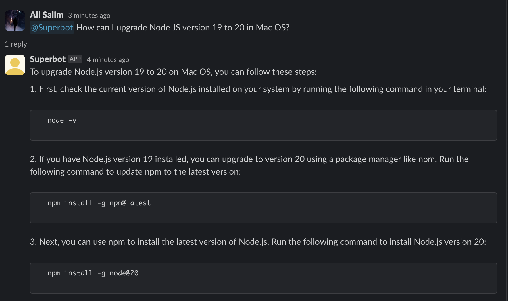

## SuperBot for Slack

SuperBot for Slack is a powerful Slack bot that integrates with SuperAgent AI. It's developed using TypeScript and can be easily deployed using AWS Lambda functions or any other containerized environment using Docker.



### Deployment Guide

Follow these step-by-step instructions to deploy SuperBot for Slack:

1. **Clone the Repository:**
   ```bash
   git clone https://github.com/superagent-ai/slack-bot
   ```

3. **Set Up Environment Variables:**
   Copy the `.env.example` file and rename it to `.env`. Fill in the following environment variables:

   - `SUPERAGENT_AGENT_ID` or `SUPERAGENT_WORKFLOW_ID`: ID of your SuperAgent AI agent or workflow.
   - `SUPERAGENT_API_BASE_URL`: Base URL for the SuperAgent API.
   - `SUPERAGENT_API_KEY`: Superagent API Key.
   - `SLACK_SIGNING_SECRET`: Signing secret of your Slack app.
   - `SLACK_BOT_TOKEN`: Bot token of your Slack app.

   #### Superagent Environment Variables:
   - Create a workflow on the [Superagent workflows page](https://beta.superagent.sh/workflows).
   - Add your Workflow ID as `SUPERAGENT_WORKFLOW_ID` in .env
   - Create a new API key on the [Superagent API Keys page](https://beta.superagent.sh/settings/api-keys) and 
   - Add the API Key as `SUPERAGENT_API_KEY` in .env

   #### Slack Environment Variables:
   - Create a Slack app on the [Slack API page](https://api.slack.com/apps?new_app=1) --> `From App Manifest` --> Select your Workspace --> Copy the [manifest.yaml](https://github.com/superagent-ai/superagent-slack-bot/blob/main/manifest.yaml) and paste it to Slack's code editor
   - Go to `Basic Information` -> Copy & Add the secret as `SLACK_SIGNING_SECRET` to `.env` --> Click `Install To Workspace` button
   - Go to `OAuth & Permissions` --> Copy the `Bot User OAuth Token` and add it as `SLACK_BOT_TOKEN` in .env
   - OPTIONAL: Go Back to Slack --> Click on your Profile picture --> Profile --> Click on 3 dots (in the right panel) --> Copy member ID 
   & add it as `SLACK_ADMIN_MEMBER_ID` in .env 
   
   

4. **Deployment:**

   #### One Click Deployments:

   [](https://vercel.com/new/clone?repository-url=https://github.com/superagent-ai/superagent-slack-bot)

   [](https://railway.app/template/q14UEX)

   You will need to add the environment variables in the Vercel or Railway dashboard after deploying. (See Step 3) 
   
   -------
   
   <a href="./docs/deploy/aws-lambda.md">
      
   </a>
   <br>
   
   -----
   Want to deploy another platform? Build and deploy the Docker image using the following command:
   ```bash
   docker build -t superagent-slack-bot .
   docker run -p 8000:8000 superagent-slack-bot
   ```
 
5. **Setting Up Slack Events:**
   - After successful deployment, copy the `/events` endpoint URL.
   - Enable events in Slack's `Event Subscriptions`.
   - Subscribe to `app_mention` events and set the Request URL to the Lambda URL.
   - Create a new slash command `/help` and set the Request URL to the Lambda URL ending with `/commands`.